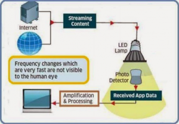

# **LIFI (Light Fidelity)**

LiFi adalah salah satu teknologi nirkabel yang memiliki fungsi tidak jauh berbeda dengan WiFi yaitu teknologi nirkabel dua arah dengan kecepatan tinggi, Definisi LiFi (Light Fidelity) merupakan sistem pada teknologi komunikasi nirkabel dua arah yang memiliki kecepatan 100 kali lebih cepat dibandingkan dengan WiFi.

Li-Fi memanfaatkan lampu LED untuk mentransfer data pada spektrum cahaya tampak. Sementara Wi-Fi atau Wireless Fidelity, menggunakan gelombang elektromagnetik pada frekuensi radio untuk mengirimkan data melalui router Wi-Fi. Perbedaan antara keduanya beragam, yang paling jelas adalah Wi-Fi menggunakan gelombang radio, sedangkan Li-Fi memanfaatkan cahaya.

### Bagaimana Cara Kerja Li-Fi?

Untuk membuat Li-Fi ini bekerja, Anda membutuhkan dua sumber cahaya yang berada pada masing-masing ujung perangkat. Sumber cahaya yang bisa digunakan yaitu LED atau detektor foto (Light Sensor). Saat cahaya LED menyala, cahaya sensor pada ujung perangkat lainnya akan mendeteksinya dan mengartikannya sebagai biner 1.
Lalu seperti apa sebuah data dapat dikirimkan dengan teknologi Li-Fi ini? Dalam jumlah cahaya LED tertentu tadi, sebuah pesan akan dapat dikirimkan dan kemudian ditangkap oleh detector cahaya pada perangkat lainnya.
Selanjutnya teknologi Li-Fi ini akan memakai beberapa warna pada cahaya LED. Jika warna-warna ini menyala bersama-sama maka hal ini akan menciptakan bangunan informasi yang sangat besar untuk dikirimkan secara sekaligus.

Saat ini saja hanya dengan penggunaan laser warna hijau dan laser warna merah dengan bersamaan sebuah data bisa terkirim pada kecepatan 1 Gbps. Bagaimana jika teknologi ini menggunakan banyak warna? Tentu saja kecepatannya akan mencapai berkali-kali lipat.
Mengapa Li-Fi Begitu Cepat?

Li-Fi yang memiliki kecepatan data berkali-kali lipat dibandingkan dengan Wi-Fi ini disebabkan karena jenis LED yang merupakan semikonduktor punya sifat berbeda dari jenis lampu lain. Dengan sifat dan ciri-ciri seperti ini membuat LED mampu untuk beralih on dan off dalam beberapa nanodetik atau miliar detik.

Nanodetik ini jika dikonversikan dalam kecepatan data setara dengan 1 Gbits/s. Maka dari itu saat Wi-Fi hanya bisa mencapai 100 Mbits/s kecepatan data, maka ini artinya Li-Fi memiliki kecepatan 10 kali lebih cepat dari Wi-Fi.

### Keuntungan Dan Keunggulan Li-Fi

Keuntungan menggunakan Li-Fi ini adalah memudahkan siapa saja untuk mengakses internet dimana pun bahkan di wilayah terpencil sekalipun yang tidak bisa dijangkau oleh kabel optik. Selain itu Li-Fi juga dapat digunakan mengontrol kondisi lalu lintas dengan cara menempatkan teknologi baru ini ke LED mobil.
Fungsi yang sama ternyata juga dapat diterapkan dengan lampu overhead pesawat. Keunggulan lain dari teknologi Li-Fi adalah mampu mengurangi polusi elektromagnetik yang dihasilkan oleh gelombang radio.

### Kelemahan dan Tantangan Li-Fi

Meski memiliki banyak keunggulan teknologi Li-Fi juga masih memiliki beberapa kelemahan dibanding sistem Wi-Fi konvensional. Li-Fi yang diterapkan secara base station pada langit-langit ruangan ini membutuhkan direct line of sight atau “pandangan” langsung ke perangkat tujuan. Direct line ini ternyata juga harus dilengkapi receiver khusus, seperti koneksi infra red pada gadget jadul.
Selain itu, perangkat tujuan ini harus tidak boleh dipindah-pindahkan. Dari perkembangan yang ada, teknologi Li-Fi juga menyimpan banyak tantangan antara lain membutuhkan line-of-sight yang sempurna untuk mengirimkan data. Tantangan berat lainnya yaitu cara mengirimkan kembali data ke pemancar secara optimal

### Standard Li-Fi

Seperti Wi-Fi, Li-Fi adalah teknologi nirkabel dan menggunakan protokol 802.11 yang serupa, tetapi Li-Fi menggunakan ultraviolet, inframerah dan komunikasi cahaya tampak (bukan gelombang frekuensi radio), yang memiliki bandwidth jauh lebih besar. Satu bagian dari VLC dimodelkan setelah protokol komunikasi yang dibuat oleh kelompok kerja IEEE 802. Namun, standar IEEE 802.15.7 sudah ketinggalan zaman: ia gagal untuk mempertimbangkan perkembangan teknologi terbaru dalam bidang komunikasi nirkabel optik, khususnya dengan pengenalan metode modulasi optical orthogonal frequency-division multiplexing (O-OFDM) yang telah dioptimalkan untuk kecepatan data, akses ganda dan efisiensi energi. Pengenalan O-OFDM berarti bahwa drive baru untuk standardisasi komunikasi nirkabel optik diperlukan.

Rekomendasi G.9991 (“Transceiver komunikasi cahaya tampak berkecepatan tinggi dalam ruangan – Arsitektur sistem, spesifikasi lapisan fisik dan lapisan data” / “High-speed indoor visible light communication transceiver – System architecture, physical layer and data link layer specification”) baru-baru ini diterbitkan oleh ITU-T. Ini adalah langkah besar dalam adopsi luas teknologi LiFi dalam berbagai aplikasi dari jaringan rumah / perusahaan ke IoT. Rekomendasi baru ini menggambarkan sistem komunikasi kecepatan tinggi dengan latensi rendah yang dirancang khusus untuk mengatasi tantangan LiFi.

Li-Fi baru saja diperkenalkan dalam beberapa tahun terakhir. Menjadi terkenal dengan cepat ketika pendiri Harald Haas dari University of Edinburgh memberikan TEDtalk. Kemungkinannya adalah, Li-Fi akan mengisi celah yang tidak bisa dilakukan oleh Wi-Fi dan Bluetooth — untuk digunakan di pesawat terbang atau untuk keamanan ekstra. Namun Wi-Fi dan Bluetooth juga terus berkembang (Bluetooth 5 dan Mesh baru keluar pada 2017), sehingga kita masih perlu terus melihat masa depan ketiga teknologi ini, apalagi untuk implementasi IoT.
PureLiFi menunjukkan sistem Li-Fi pertama yang tersedia secara komersial, Li-1st, pada Mobile World Congress 2014 di Barcelona. Pada Juni 2018, Li-Fi lulus uji coba oleh pabrik BMW di Munich untuk beroperasi di lingkungan industri. Manajer proyek BMW Gerhard Kleinpeter berharap miniaturisasi transceiver Li-Fi, agar Li-Fi digunakan secara efisien di plant produksi. Pada bulan Agustus 2018, Kyle Academy, sebuah sekolah menengah di Skotlandia, menjadi pilot project penggunaan Li-Fi di sekolah. Siswa dapat menerima data melalui koneksi antara komputer laptop mereka dan perangkat USB yang mampu menerjemahkan arus on-off yang cepat dari LED langit-langit menjadi data. Pada Juni 2019, perusahaan Prancis Oledcomm menguji teknologi Li-Fi mereka di Paris Air Show2019. Oledcomm berharap untuk berkolaborasi dengan Air France di masa depan untuk menguji Li-Fi dengan pesawat terbang dalam pesawat. Menurut Energias Market Research (data yang dirilis pertengahan Februari 2018) pasar Light Fidelity di seluruh dunia diperkirakan akan mencapai lebih dari USD 80 Juta pada tahun 2023.
