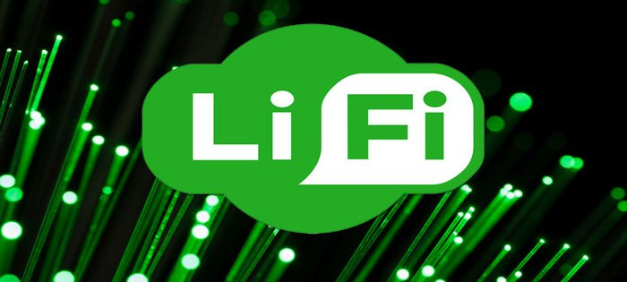

# **LIFI (Light Fidelity)**

LiFi adalah salah satu teknologi nirkabel yang memiliki fungsi tidak jauh berbeda dengan WiFi yaitu teknologi nirkabel dua arah dengan kecepatan tinggi, Definisi LiFi (Light Fidelity) merupakan sistem pada teknologi komunikasi nirkabel dua arah yang memiliki kecepatan 100 kali lebih cepat dibandingkan dengan WiFi.

Li-Fi memanfaatkan lampu LED untuk mentransfer data pada spektrum cahaya tampak. Sementara Wi-Fi atau Wireless Fidelity, menggunakan gelombang elektromagnetik pada frekuensi radio untuk mengirimkan data melalui router Wi-Fi. Perbedaan antara keduanya beragam, yang paling jelas adalah Wi-Fi menggunakan gelombang radio, sedangkan Li-Fi memanfaatkan cahaya.

Bagaimana Cara Kerja Li-Fi?

Untuk membuat Li-Fi ini bekerja, Anda membutuhkan dua sumber cahaya yang berada pada masing-masing ujung perangkat. Sumber cahaya yang bisa digunakan yaitu LED atau detektor foto (Light Sensor). Saat cahaya LED menyala, cahaya sensor pada ujung perangkat lainnya akan mendeteksinya dan mengartikannya sebagai biner 1.
Lalu seperti apa sebuah data dapat dikirimkan dengan teknologi Li-Fi ini? Dalam jumlah cahaya LED tertentu tadi, sebuah pesan akan dapat dikirimkan dan kemudian ditangkap oleh detector cahaya pada perangkat lainnya.
Selanjutnya teknologi Li-Fi ini akan memakai beberapa warna pada cahaya LED. Jika warna-warna ini menyala bersama-sama maka hal ini akan menciptakan bangunan informasi yang sangat besar untuk dikirimkan secara sekaligus.

Saat ini saja hanya dengan penggunaan laser warna hijau dan laser warna merah dengan bersamaan sebuah data bisa terkirim pada kecepatan 1 Gbps. Bagaimana jika teknologi ini menggunakan banyak warna? Tentu saja kecepatannya akan mencapai berkali-kali lipat.
Mengapa Li-Fi Begitu Cepat?

Li-Fi yang memiliki kecepatan data berkali-kali lipat dibandingkan dengan Wi-Fi ini disebabkan karena jenis LED yang merupakan semikonduktor punya sifat berbeda dari jenis lampu lain. Dengan sifat dan ciri-ciri seperti ini membuat LED mampu untuk beralih on dan off dalam beberapa nanodetik atau miliar detik.

Nanodetik ini jika dikonversikan dalam kecepatan data setara dengan 1 Gbits/s. Maka dari itu saat Wi-Fi hanya bisa mencapai 100 Mbits/s kecepatan data, maka ini artinya Li-Fi memiliki kecepatan 10 kali lebih cepat dari Wi-Fi.

### Keuntungan Dan Keunggulan Li-Fi

Keuntungan menggunakan Li-Fi ini adalah memudahkan siapa saja untuk mengakses internet dimana pun bahkan di wilayah terpencil sekalipun yang tidak bisa dijangkau oleh kabel optik. Selain itu Li-Fi juga dapat digunakan mengontrol kondisi lalu lintas dengan cara menempatkan teknologi baru ini ke LED mobil.
Fungsi yang sama ternyata juga dapat diterapkan dengan lampu overhead pesawat. Keunggulan lain dari teknologi Li-Fi adalah mampu mengurangi polusi elektromagnetik yang dihasilkan oleh gelombang radio.

### Kelemahan dan Tantangan Li-Fi

Meski memiliki banyak keunggulan teknologi Li-Fi juga masih memiliki beberapa kelemahan dibanding sistem Wi-Fi konvensional. Li-Fi yang diterapkan secara base station pada langit-langit ruangan ini membutuhkan direct line of sight atau “pandangan” langsung ke perangkat tujuan. Direct line ini ternyata juga harus dilengkapi receiver khusus, seperti koneksi infra red pada gadget jadul.
Selain itu, perangkat tujuan ini harus tidak boleh dipindah-pindahkan. Dari perkembangan yang ada, teknologi Li-Fi juga menyimpan banyak tantangan antara lain membutuhkan line-of-sight yang sempurna untuk mengirimkan data. Tantangan berat lainnya yaitu cara mengirimkan kembali data ke pemancar secara optimal
